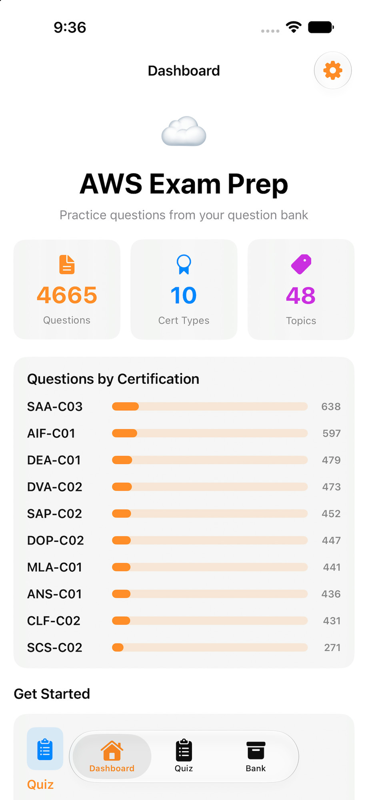
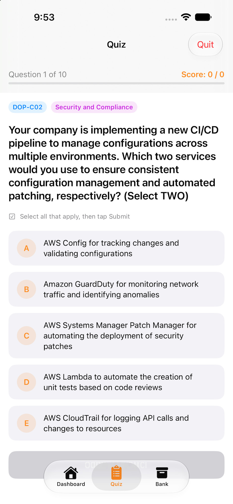
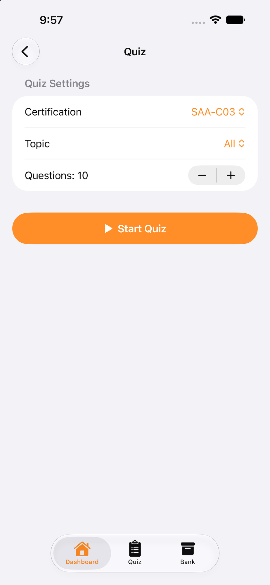
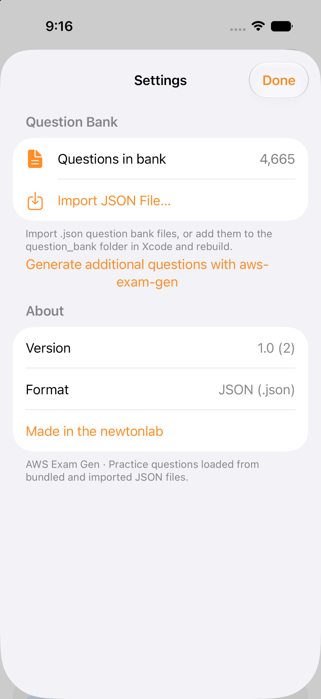

# AWS Exam Gen

A simple iOS/macOS SwiftUI app for studying AWS certification questions.

## Features

- Browse and take quizzes generated from JSON question banks.
- View progress and review answers.

## Screenshots

**Dashboard**

**Quiz**

**Quiz Settings**

**Settings**

## Getting started

### Requirements

- Xcode 15 or later
- Swift 5.9+ (use the version bundled with Xcode)

### Open the project

- Open the Xcode project/workspace: [AWSExamGen.xcodeproj](AWSExamGen.xcodeproj) or the workspace if you use Swift packages.

### Run

- Select a simulator or a connected device and press Run (⌘R) in Xcode.

## Question banks

- In the app, go to Settings → Import JSON File to add a question bank from the Files app at runtime. Imported files are copied into app storage and merged with the bundled question bank.
- Alternatively, add or update question files in the `question_bank/` folder and rebuild to bundle them with the app.
- Example files are already present:
  - `question_bank/SAA-C03_119q_20260811T203925.json`

### Question source

The questions included in this project were generated using [aws-exam-gen](https://github.com/shackdan/aws-exam-gen).

## Project layout

Important files:

- [AWSExamGen/Models/Questions.swift](AWSExamGen/Models/Questions.swift): question models
- [AWSExamGen/Services/QuestionBankService.swift](AWSExamGen/Services/QuestionBankService.swift): loads and parses question JSON files
- [AWSExamGen/Views/QuizView.swift](AWSExamGen/Views/QuizView.swift): quiz UI

## Contributing

- Drop additional JSON files into `question_bank/` and open the app to use them.
- If you add new features, please follow the existing SwiftUI patterns.

## License

See the [LICENSE](LICENSE) file.

## Questions or issues

Open an issue or contact the repository owner.